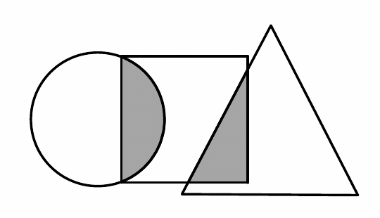
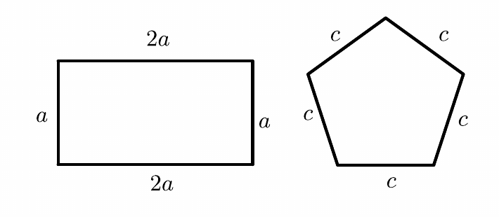

# 第 1 讲 比和比例 原题巩固

> 顾景源 · 五年级数学 · 学而思秋季班  
> **打印版：** `第1讲-原题巩固.pdf`

---

## 第 1 题　（W1-Day1-1）

先化简下面各比，再求比值。（从第 1 行开始，从左往右填完再填第 2 行）

| | a | c |
|------|------|------|
| 比 | 0.15 : 0.3 | 0.24 : 2/5 |
| 化简后的比 | | |
| 比值 | | |

## 第 2 题　（W1-Day1-3）

一个比例式的前两项互为倒数，比值为 4，内项积为 4，这个比例式的两个外项之和是 ______ 。

## 第 3 题　（W1-Day2-4）

用 1/4、1/6、8、12 这四个数组成比例，下面选项中正确的是（　　）。

A. 1/6 : 1/4 = 12 : 8

B. 8 : 1/4 = 1/6 : 12

C. 1/6 : 1/4 = 8 : 12

## 第 4 题　（W1-Day3-8）

求比值：123 : 123 123/124 = ______ 。

## 第 5 题　（W1-Day3-9）

如图，长方形中左侧阴影部分的面积占圆面积的 1/8，占长方形面积的 3/10，长方形右侧阴影部分面积占大三角形面积的 2/15，占长方形面积的 1/5，则圆、长方形、大三角形的面积的最简整数比是 ______ 。

## 第 6 题　（W1-Day4-10）

如图，若长方形的周长是正五边形周长的 1.5 倍，则 a : c = ______ : ______ 。

## 第 7 题　（W1-Day4-11）

已知 a : b = 3/2 : 1.2，b : c = 0.75 : 1/2，那么 c : a = ______ 。（写成最简整数比）

## 第 8 题　（W1-Day4-12）

已知甲、乙、丙三个数，甲的一半等于乙的 3 倍，也等于丙的 2/3，那么甲的 2/3、乙的 2 倍、丙的一半，这三个数的比为多少？

答：__________

